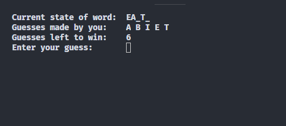

# Hungman Game
The classic hungman game on the console. A project based on a random Stanford university assignment, found online 😂

## Goals

Project Goals includes :
- It should be a Hangman
- Playable
- Easy to play again and again
- Nice CLI to engage user
- Help user to achieve success in guessing word

Personal Goals of a person contributing to this project may be:
- Get started open source
- Learn new things
- Help Make something cool
- Test yourself on a new language (If you don't speak Java).

## Non Goals
- Shouldn't have a GUI (instead Focus on best experience on terminal).
- Should't be boring

## Getting into OpenSource
Anyone who want to start open source on a java project. This could be a perfect start as it being having very low barrier for entry.

## Collaborate
Anyone want to collaborate, work and suggest goals and make this a success, please open a issue.
Or Contact me on Twitter @rishabh31121999

